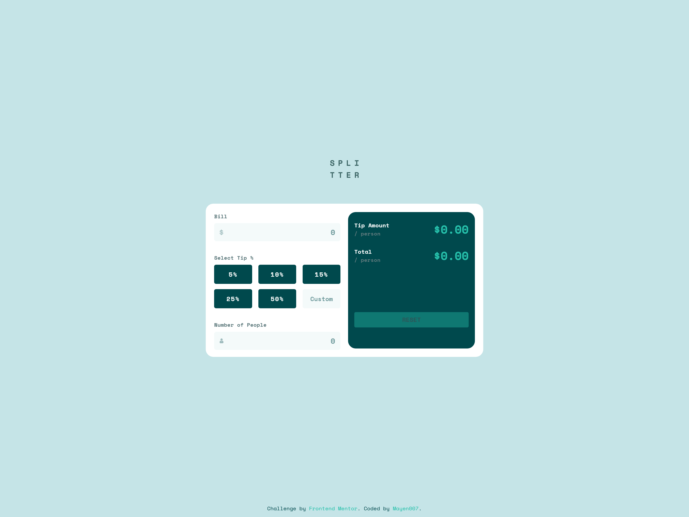

# Frontend Mentor - Tip Calculator App Solution

This is a solution to the [Tip Calculator App challenge on Frontend Mentor](https://www.frontendmentor.io/challenges/tip-calculator-app-ugJNGbJUX). Frontend Mentor challenges help you improve your coding skills by building realistic projects.

## Table of Contents

- [Overview](#overview)
  - [The Challenge](#the-challenge)
  - [Screenshot](#screenshot)
  - [Links](#links)
- [My Process](#my-process)
  - [Built With](#built-with)
  - [What I Learned](#what-i-learned)
  - [Continued Development](#continued-development)
  - [Useful Resources](#useful-resources)
- [Author](#author)
- [Acknowledgments](#acknowledgments)

## Overview

### The Challenge

Users should be able to:

- View the optimal layout for the app depending on their device's screen size.
- See hover states for all interactive elements on the page.
- Calculate the correct tip and total cost of the bill per person.
- Input custom tip percentages and see the corresponding calculations.
- Reset the form with a button that clears the input values.

### Screenshot



### Links

- Solution URL: [View solution here](https://github.com/Mayen007/tip-calculator-app)
- Live Site URL: [Live Demo](https://mayen007.github.io/tip-calculator-app/)

## My Process

### Built With

- HTML5 and CSS3 for semantic markup and styling
- Custom properties for easy theme management
- JavaScript for functionality and dynamic interactions
- Mobile-first design for responsive layout
- Focused on user input validation and error handling

### What I Learned

Through building this Tip Calculator app, I learned how to manage user input dynamically with JavaScript. The biggest challenge was ensuring that the tip and total amounts updated correctly based on the user's input, while also handling cases like zero or missing inputs. I also worked on error handling, especially for invalid inputs, and creating a smooth user experience.

For instance, here's how I handled input validation for the number of people:

```javascript
if (peopleInput.value === "" || peopleValue === 0) {
  peopleError.textContent = "Can't be zero";
  peopleInputCont.classList.add("error");
} else {
  peopleError.textContent = "";
  peopleInputCont.classList.remove("error");
}
```

### Continued Development

In future projects, I would like to refine my JavaScript skills, particularly around form validation and error handling. I'd also like to explore integrating CSS frameworks like Bootstrap to speed up development, and possibly use React for more interactive functionality.

Additionally, I plan to improve accessibility by adding ARIA attributes and ensuring better screen reader support for users with disabilities.

### Useful Resources

- [MDN Web Docs](https://developer.mozilla.org/en-US/) - A great resource for learning about HTML, CSS, and JavaScript.
- [CSS-Tricks](https://css-tricks.com/) - Helped me understand CSS Flexbox and Grid layouts more deeply.
- [JavaScript Info](https://javascript.info/) - A fantastic tutorial site that helped me with deeper JavaScript concepts and DOM manipulation.

## Author

- GitHub - [Mayen007](https://github.com/Mayen007)
- Frontend Mentor - [@Mayen007](https://www.frontendmentor.io/profile/mayen007)


## Acknowledgments

Thanks to the Frontend Mentor community for providing this challenge and the opportunity to practice coding. I also want to thank [resource name] for their insightful article on form validation that helped me with the error handling in this project.
